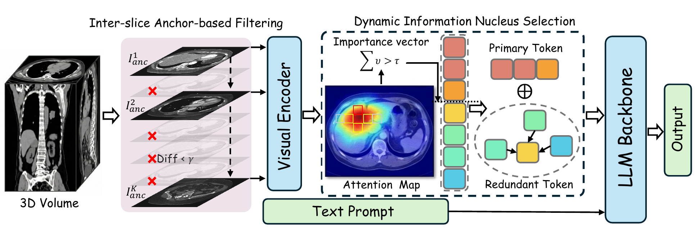

<p align="center">
  
</p>

# [MICCAI 26] MedPruner: Training-Free Hierarchical Token Pruning for Efficient 3D Medical Image Understanding in Vision-Language Models

<p align="center">
  <a href="https://arxiv.org/abs/2603.11625"></a>
  <a href="README_CN.md"></a>
</p>



MedPruner is a training-free hierarchical visual token pruning method for efficient 3D medical image understanding in vision-language models. It removes redundant inter-slice information with anchor-based filtering, then performs token-level dynamic information nucleus selection to reduce inference cost while preserving diagnostic accuracy.

This repository also includes Med3D, an evaluation framework for 3D medical imaging (CT/MRI) vision-language models, with built-in MedPruner support.

## ✨ Key Features

- **3D Medical Image Evaluation**: End-to-end evaluation on 3D volumetric data including CT and MRI (Amos, M3D, 3DRad)
- **Visual Token Pruning (MedPruner)**: Two-level pruning strategy combining slice-level and token-level compression to reduce visual tokens, memory usage, and inference time
- **Multi-Model Support**: Unified interface for Qwen3-VL, HuluMed, and MedGemma medical VLMs
- **Multi-GPU Parallelism**: Data-parallel evaluation across multiple GPUs

## 🛠️ Setup

```bash
# Create conda environment
conda create -n med3d python=3.10
conda activate med3d

# Video processing dependencies
pip install decord ffmpeg-python imageio opencv-python
pip install qwen_vl_utils nltk rouge mathruler pylatexenc

# 3D medical image processing (NIfTI files)
pip install nibabel

# Install other dependencies
pip install -r requirements.txt

# Install medpruner package
cd medpruner && pip install -e .
```

## 📚 Datasets

Dataset download: [Hulu Eval Dataset](https://modelscope.cn/models/Med-Team/Hulu-Med)

Place the datasets under `data/Eval/` with the following structure:
```
data/Eval/
├── Amos/
│   ├── amos_test_crop_32/
│   └── amos_val_mrg_sft.json
├── 3DRad/
│   └── ...
└── M3D/
    └── ...
```

## 🤖 Supported Models

| Model | Backend | MedPruner |
|-------|---------|:---:|
| Qwen3-VL | transformers | ✓ |
| HuluMed Qwen2 | transformers | ✓ |
| MedGemma | transformers | ✓ |

## 🧪 Supported Benchmarks

| Dataset | Modality | Description |
|---------|----------|-------------|
| Amos | 3D CT/MRI | Multi-organ segmentation and report generation |
| M3D | 3D CT | Full-body CT visual question answering |
| 3DRad | 3D CT | Radiology report generation |

## ⚙️ MedPruner Configuration

MedPruner reduces visual tokens through two pruning levels:

- **Slice-level pruning (slice_compose)**: Drops redundant frames whose anchor-frame L1 distance is below threshold `gamma`
- **Token-level pruning (token_compose)**: Retains key tokens whose cumulative attention mass reaches `tau`, and aggregates the rest by similarity

Configuration file `config/config.json`:

```json
{
  "medpruner": {
    "slice_compose": true,
    "token_compose": true,
    "tau": 0.9,
    "gamma": 0.05
  }
}
```

| Parameter | Type | Description |
|-----------|------|-------------|
| `slice_compose` | bool | Enable slice-level inter-frame compression |
| `token_compose` | bool | Enable token-level attention selection |
| `tau` | float | Cumulative attention mass threshold (0~1), controls token retention. Lower values keep fewer tokens |
| `gamma` | float | Anchor-frame L1 distance threshold; frames below this value are discarded |

Pruning rates: after evaluation, `compression_rate` (slice pruning retention), `dyn_token_rate` (token pruning retention), and `select_rate` (overall retention) are reported.

## 🚀 Evaluation

```bash
cd MedUniEval

# Evaluate Amos / 3DRad
bash ./eval.sh

# Evaluate M3D (chunked evaluation)
bash ./eval_M3D_chunked.sh
```

Key environment variables:

| Variable | Description |
|----------|-------------|
| `EVAL_DATASETS` | Dataset name, e.g. `Amos`, `M3D`, `3DRad` |
| `MODEL_NAME` | Model registry name, e.g. `Qwen3-VL`, `Hulumed_qwen2` |
| `MODEL_PATH` | Path to model weights |
| `COMPRESSION` | Pruning method, set to `medpruner` to enable |
| `CUDA_VISIBLE_DEVICES` | Available GPUs; multiple GPUs enable data parallelism |


## 🙏 Acknowledgements
Greatly appreciate the tremendous effort for the following projects!
- [Visionzip](https://github.com/JIA-Lab-research/VisionZip)
- [Hulu-Med](https://github.com/ZJUI-AI4H/Hulu-Med)
- [MedGemma](https://huggingface.co/google/medgemma-1.5-4b-it)


## 📖 Citation
```
@misc{liu2026medprunertrainingfreehierarchicaltoken,
      title={MedPruner: Training-Free Hierarchical Token Pruning for Efficient 3D Medical Image Understanding in Vision-Language Models}, 
      author={Shengyuan Liu and Zanting Ye and Yunrui Lin and Chen Hu and Wanting Geng and Xu Han and Bulat Ibragimov and Yefeng Zheng and Yixuan Yuan},
      year={2026},
      eprint={2603.11625},
      archivePrefix={arXiv},
      primaryClass={cs.CV},
      url={https://arxiv.org/abs/2603.11625}, 
}
```
